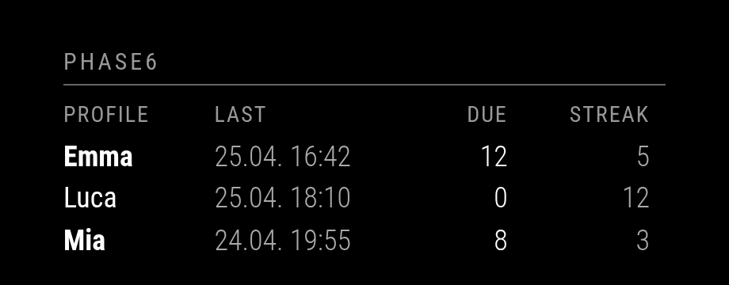

# MMM-phase6

> **100% vibe coded** — this module was fully created through AI-assisted development.

A [MagicMirror²](https://magicmirror.builders/) module that displays [phase6](https://www.phase-6.de/) vocabulary learning statistics for your family profiles.



**Shown per profile:**
- Last learned date
- Due vocabulary count
- Current learning streak (days in a row)

> **Note:** This is an *unofficial* community module. It uses web scraping and may
> break if phase6 changes their website layout or login flow.

## Installation

```bash
cd ~/MagicMirror/modules
git clone https://github.com/ms-zone-41/MMM-phase6.git MMM-phase6
cd MMM-phase6
npm install
```

**Requirements:** Node.js 18 or later (for native `fetch` support).

## Configuration

Add the following to the `modules` array in your `config/config.js`:

```js
{
  module: "MMM-phase6",
  position: "top_right",
  config: {
    username: "your-phase6-email",
    password: "your-phase6-password",
  }
}
```

> **Security tip:** Instead of putting credentials in `config.js`, use
> environment variables `PHASE6_USER` and `PHASE6_PASS`.

### Configuration Options

| Option | Type | Default | Description |
|--------|------|---------|-------------|
| `username` | `string` | `""` | phase6 login email/username |
| `password` | `string` | `""` | phase6 login password |
| `sessionCookies` | `string[]` | `[]` | Manual browser cookies (see [Troubleshooting](#troubleshooting)) |
| `updateInterval` | `number` | `600000` | Data refresh interval in ms (default: 10 min) |
| `requestTimeoutMs` | `number` | `20000` | HTTP request timeout in ms |
| `overviewPath` | `string` | `"/classic/service/user/parent/"` | Account overview page path |
| `onlyChildren` | `boolean` | `true` | Only show child profiles |
| `showAccounts` | `string[]` | `[]` | Filter: only show these names (`[]` = all) |
| `excludeAccounts` | `string[]` | `[]` | Filter: hide these profile names |
| `hideSurname` | `boolean` | `true` | Auto-detect and hide family surname |
| `surnameToHide` | `string` | `""` | Explicit surname to hide (if auto-detect fails) |
| `showHeader` | `boolean` | `true` | Show the module header |
| `title` | `string` | `"phase6"` | Module header title |
| `showLicense` | `boolean` | `false` | Show license label (e.g. "PLUS aktiv") |
| `showLastLearned` | `boolean` | `true` | Show "Last learned" column |
| `lastLearnedShowYear` | `boolean` | `false` | Include the year in the date |
| `showDueVocab` | `boolean` | `true` | Show "Due vocab" column |
| `showStreak` | `boolean` | `true` | Show "Streak" column |
| `showFetchedAt` | `boolean` | `false` | Show "Updated: ..." timestamp below table |
| `locale` | `string` | `"de-DE"` | Locale for date formatting |
| `dueAdjustments` | `object` | `{}` | Per-account adjustment to the **Due** count, e.g. `{ "Emma": -1 }`. Useful to compensate for items that phase6 still counts as due even though they are already complete. The adjustment is added to the scraped value and clamped to `0`. Lookup is case-insensitive and works on both display name and full name. |

### Bold profile names

Profiles with `Due > 0` (after applying `dueAdjustments`) are rendered **bold**
to signal outstanding vocabulary. Profiles with no due items are rendered in
normal weight.

### Full Example

```js
{
  module: "MMM-phase6",
  position: "top_right",
  header: "phase6",
  config: {
    username: "parent@example.com",
    password: "secret",
    updateInterval: 15 * 60 * 1000,
    onlyChildren: true,
    hideSurname: true,
    showLicense: false,
    lastLearnedShowYear: false,
    showFetchedAt: false,
    // Optional: subtract 1 from the displayed Due count for these profiles
    dueAdjustments: { "Emma": -1, "Luca": -1 },
  }
}
```

## Troubleshooting

### Login fails

If the login form is loaded dynamically via JavaScript (or phase6 requires
additional SSO/verification), the built-in scraper may not work. In that case:

**Option A — Session Cookies (easiest):**

1. Log in to phase6 in your browser.
2. Open DevTools → Application → Cookies.
3. Copy the relevant cookies and add them to your config:

```js
sessionCookies: [
  "JSESSIONID=abc123...",
  "other_cookie=xyz..."
]
```

These may expire and need periodic renewal.

**Option B — Environment Variables:**

```bash
export PHASE6_USER="your-email"
export PHASE6_PASS="your-password"
```

### Debugging

1. Open the phase6 Kundenservice page in your browser.
2. Open DevTools (F12) → Network tab.
3. Log in and watch which requests deliver the profile data.
4. If phase6 exposes a JSON API, consider updating `node_helper.js`
   to use that (more stable than HTML scraping).

Check MagicMirror logs for error messages:

```bash
# If using systemd:
journalctl -u magicmirror -f | grep -i phase6

# If using pm2:
pm2 logs --lines 50 | grep -i phase6
```

## How It Works

The module's `node_helper.js` runs server-side and:

1. Logs in to the phase6 website using your credentials.
2. Navigates to the family overview page (`/classic/service/user/parent/`).
3. Parses the HTML to extract profile names, last-learned dates,
   due vocabulary counts, and streak information.
4. Sends the data to the frontend module for display.

Session cookies are managed automatically via `fetch-cookie` + `tough-cookie`.

## Disclaimer

- This module runs locally on your MagicMirror and accesses your own account.
- Please review [phase6's terms of service](https://www.phase-6.de/) before
  using automated scraping.
- No data is sent to any third party.

## License

[MIT](LICENSE)
